<div align="center">

# 🚀 TaskFlow AI

### Enterprise Employee Recommendation System

A full-stack enterprise web application that intelligently recommends the most suitable employees for software projects based on **Skill Matching**, **Experience**, **Availability**, and **Performance Score**.

Built using **Spring Boot**, **React**, **JWT Authentication**, **MySQL**, and **Swagger OpenAPI**.

<br>


</div>

---

# 📑 Table of Contents

- [Overview](#-overview)
- [Key Highlights](#-key-highlights)
- [Features](#-features)
- [Technology Stack](#-technology-stack)
- [Project Structure](#-project-structure)
- [Application Screenshots](#-application-screenshots)
- [System Architecture](#️-system-architecture)
- [Database ER Diagram](#️-database-er-diagram)
- [Recommendation Engine](#-recommendation-engine)
- [JWT Authentication Flow](#-jwt-authentication-flow)
- [REST API Modules](#-rest-api-modules)
- [Swagger Documentation](#-swagger-documentation)
- [Installation Guide](#️-installation-guide)
- [Future Enhancements](#-future-enhancements)
- [License](#-license)
- [Author](#-author)

---

# 📖 Overview

TaskFlow AI is an enterprise-level Employee Recommendation System that simplifies employee allocation for software development projects.

Instead of manually searching for suitable employees, project managers can simply select a project and receive a ranked list of the most suitable employees based on multiple evaluation criteria.

The recommendation engine evaluates:

- ✅ Technical Skills
- ✅ Required Project Skills
- ✅ Experience
- ✅ Availability
- ✅ Performance Score

The application follows modern enterprise software development practices including DTO Pattern, Layered Architecture, JWT Authentication, Spring Security, Validation, Exception Handling, Repository Pattern, REST APIs, and Swagger Documentation.

---

# 🌟 Key Highlights

A quick summary of what this project demonstrates — useful for a resume line or the first 30 seconds of an interview answer.

- **End-to-end ownership** — designed and built the backend (Spring Boot), frontend (React), database schema, authentication, and a custom recommendation algorithm from scratch.
- **Real authentication, not a toy login** — stateless JWT authentication with Spring Security, BCrypt password hashing, and role-based authorization protecting REST endpoints.
- **A genuine algorithm, not just CRUD** — the recommendation engine is a rule-based scoring system combining skill overlap, experience, availability, and performance into a ranked, percentage-based match score.
- **Documented like a production API** — every endpoint is discoverable and testable through Swagger/OpenAPI, not just described in a README.
- **Layered, maintainable architecture** — Controller → Service → Repository → Entity, with DTOs at the boundary so internal entities are never exposed directly over the API.

---

# ✨ Features

## 🔐 Authentication & Security

- JWT Authentication
- Spring Security
- Role Based Authorization
- BCrypt Password Encryption
- Protected REST APIs
- Stateless Authentication
- Secure Login
- Token Based Authorization

---

## 👨‍💼 Employee Management

- Create Employee
- Update Employee
- Delete Employee
- View Employee Details
- Employee Search
- Employee Pagination
- Employee Filtering
- Assign Skills
- Remove Skills
- Availability Status
- Performance Score
- Experience Management

---

## 📁 Project Management

- Create Project
- Update Project
- Delete Project
- Client Information
- Project Status
- Required Skills
- Required Experience
- Start & End Date
- Project Description

---

## 💻 Skill Management

- Add Skills
- Update Skills
- Delete Skills
- Assign Skills to Employees
- Remove Skills
- View Employee Skills

---

## 🤖 Recommendation Engine

- Rule-Based Recommendation Engine
- Skill Matching
- Experience Evaluation
- Availability Check
- Performance Score Evaluation
- Top Ranked Employees
- Percentage Match Score

---

## 📚 API Documentation

- Swagger UI
- OpenAPI Documentation
- REST API Testing
- JWT Secured APIs

---

# 🛠 Technology Stack

| Category | Technologies |
|----------|--------------|
| **Backend** | Java 17, Spring Boot, Spring Security, Spring Data JPA, Hibernate |
| **Frontend** | React, React Router, Axios, Bootstrap |
| **Database** | MySQL |
| **Authentication** | JWT (JSON Web Token) |
| **Documentation** | Swagger UI, OpenAPI |
| **Build Tool** | Maven |
| **Version Control** | Git, GitHub |
| **Development Tools** | IntelliJ IDEA, VS Code, MySQL Workbench, Postman |

---

# 📂 Project Structure

```text
TaskFlowAI
│
├── backend
│   ├── src
│   ├── pom.xml
│   └── ...
│
├── frontend
│   ├── src
│   ├── package.json
│   └── ...
│
├── database
│   └── taskflow_ai.sql
│
├── architecture
│   ├── Architecture Diagram.png
│   └── ER Diagram.png
│
├── screenshots
│   ├── 01-login.png
│   ├── 02-dashboard.png
│   ├── 03-employee-list.png
│   ├── 04-add-employee.png
│   ├── 05-project-list.png
│   ├── 06-add-project.png
│   ├── 07-skills-list.png
│   ├── 08-manage-skills.png
│   ├── 09-recommendation-overview.png
│   ├── 10-recommendation-banking-system.png
│   ├── 11-recommendation-ecommerce-platform.png
│   ├── 12-recommendation-hospital-erp.png
│   ├── 13-swagger-ui.png
│   ├── 14-system-architecture.png
│   └── 15-er-diagram.png
│
└── README.md
```

---

# 📸 Application Screenshots

The following screenshots demonstrate the major features of **TaskFlow AI**.

---

## 🔐 Login Page

Secure authentication using JWT.

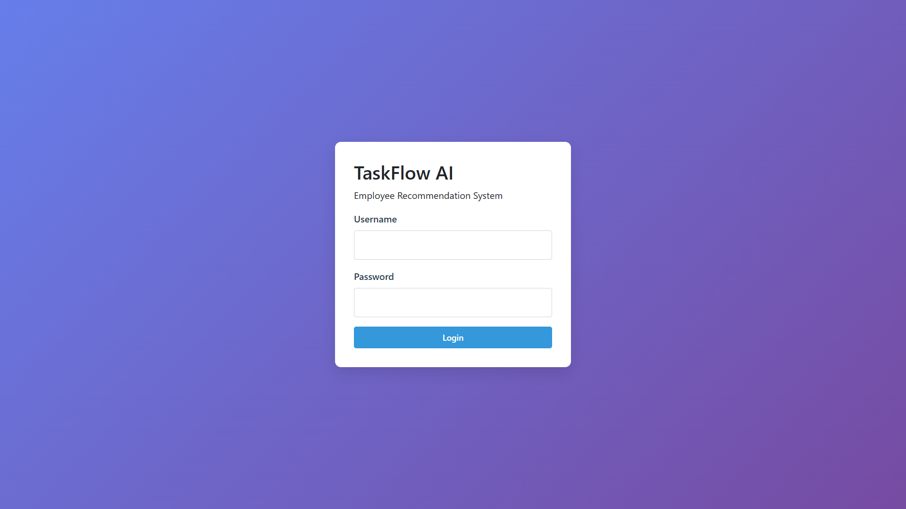

---

## 📊 Dashboard

Overview of the application with quick navigation to all modules.

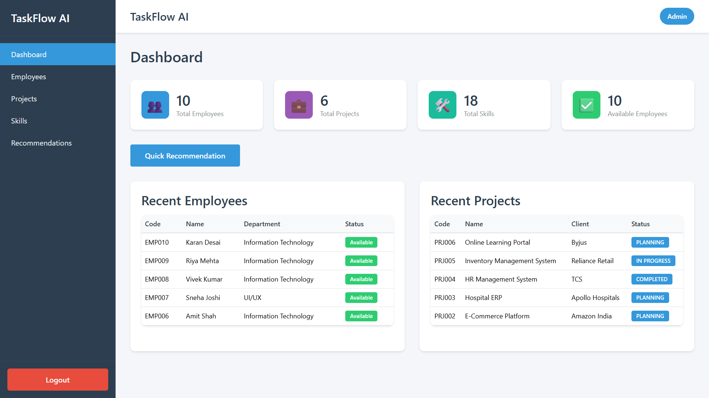

---

# 👨‍💼 Employee Management

Manage employees with complete CRUD operations.

### Employee List

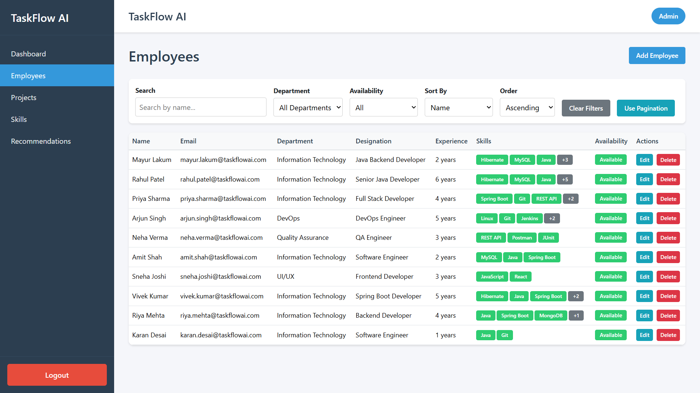

### Add Employee

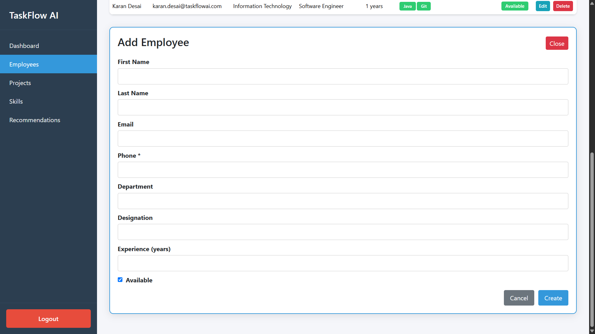

---

# 📁 Project Management

Manage projects and required skills.

### Project List

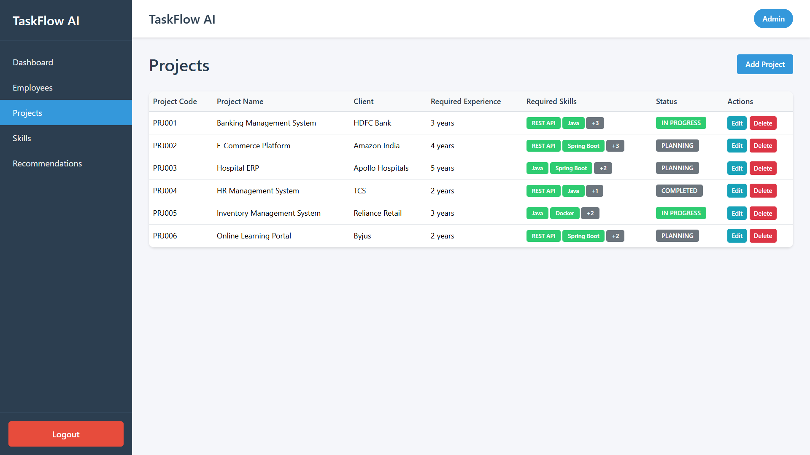

### Add Project

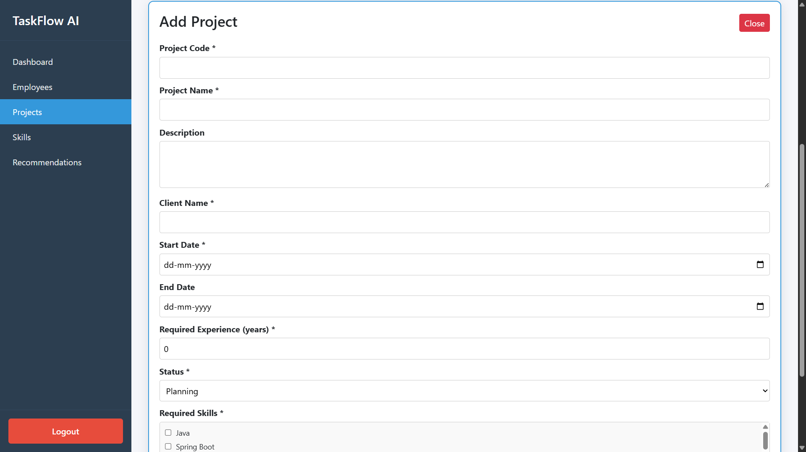

---

# 💻 Skill Management

Manage technical skills available in the organization.

### Skills List

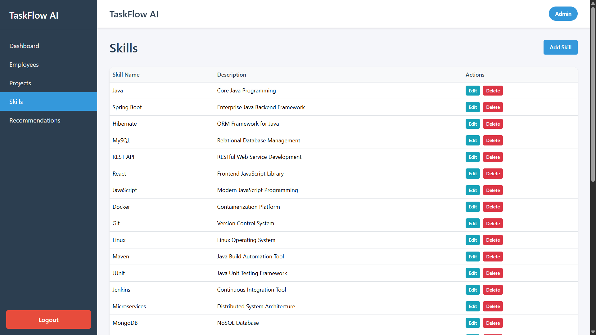

### Manage Skills

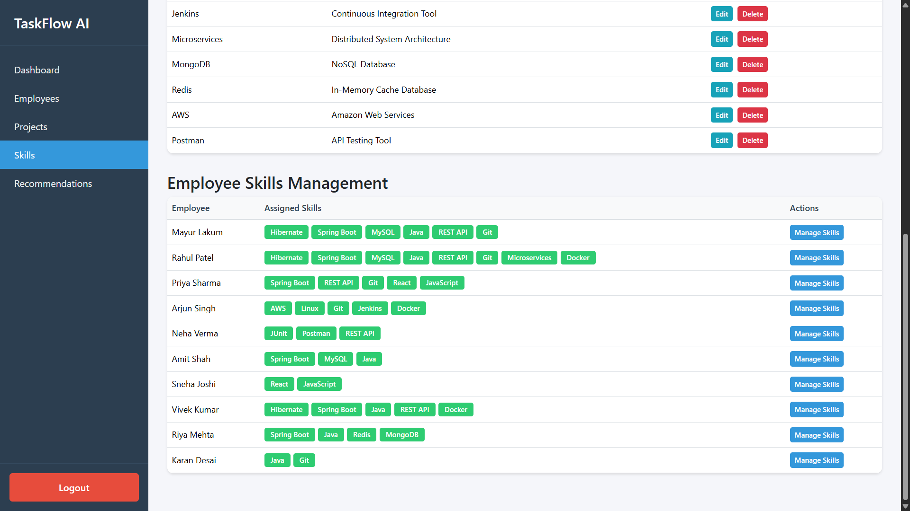

---

# 🤖 Recommendation Engine

TaskFlow AI automatically ranks employees according to project requirements.

### Recommendation Overview

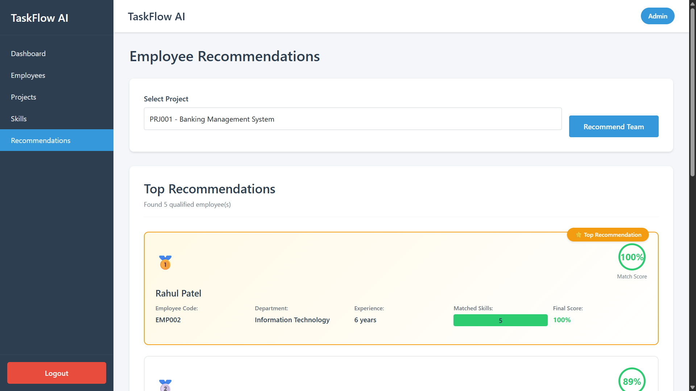

### Banking Management System Recommendation


### E-Commerce Platform Recommendation


### Hospital ERP Recommendation

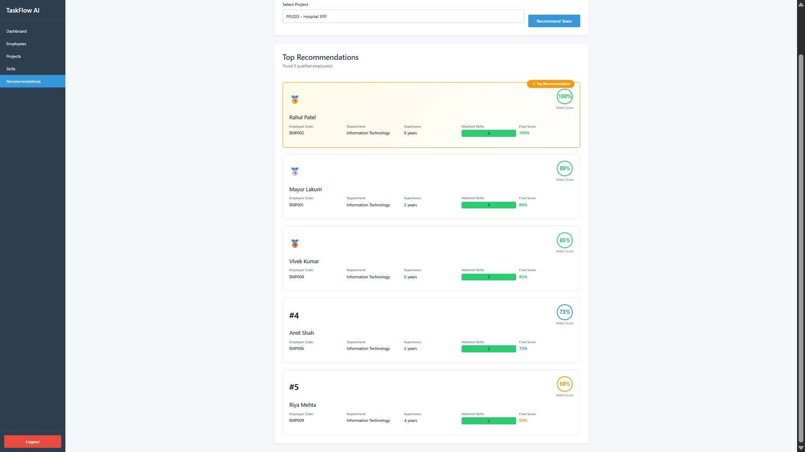

---

# 📚 Swagger API Documentation

Interactive REST API documentation generated using OpenAPI.

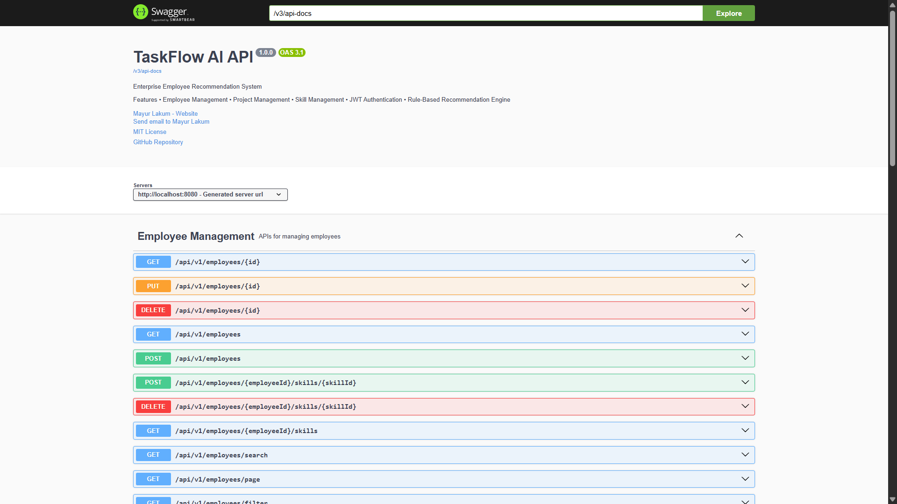

---

# 🏗️ System Architecture

The project follows a layered enterprise architecture separating presentation, business logic, persistence, and database layers.

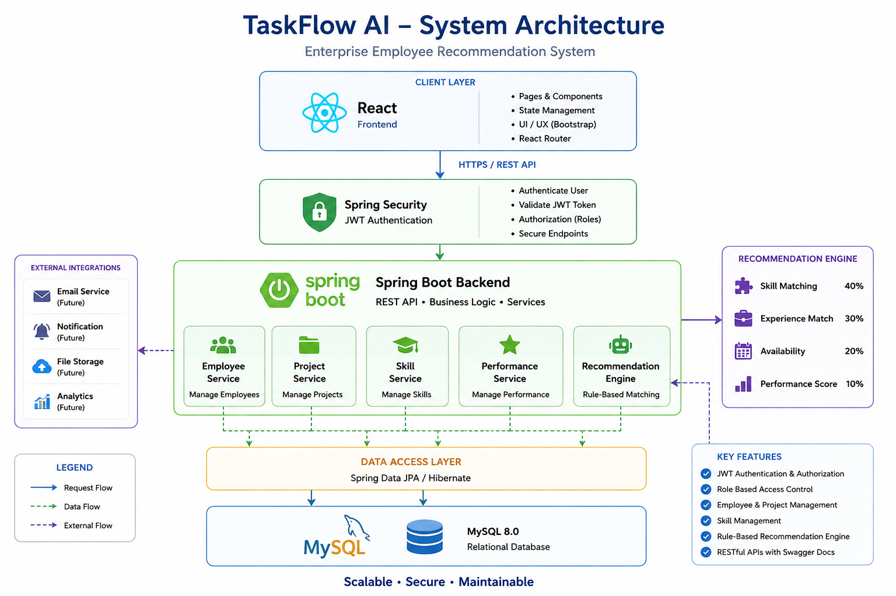

---

# 🗄️ Database ER Diagram

Entity Relationship Diagram representing the database schema.

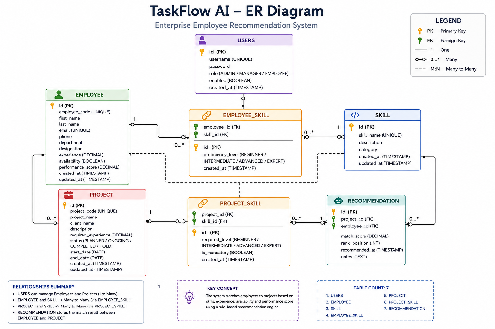

---

# 🤖 Recommendation Engine

TaskFlow AI includes a custom **Rule-Based Recommendation Engine** that helps project managers identify the most suitable employees for a project.

Instead of randomly assigning employees, the system evaluates every available employee using multiple criteria and generates a ranked recommendation list.

---

## Recommendation Workflow

```text
Project Selection
        │
        ▼
Required Skills Extraction
        │
        ▼
Employee Skill Comparison
        │
        ▼
Experience Evaluation
        │
        ▼
Availability Check
        │
        ▼
Performance Score Evaluation
        │
        ▼
Final Recommendation Score
        │
        ▼
Top 5 Recommended Employees
```

---

## Recommendation Factors

| Factor | Description |
|---------|-------------|
| Skill Matching | Compares employee skills with project required skills |
| Experience | Employees with higher relevant experience receive additional score |
| Availability | Only available employees are considered |
| Performance Score | High-performing employees receive additional weight |

---

## Sample Recommendation Output

| Rank | Employee | Match Score |
|------|----------|------------:|
| 🥇 1 | Rahul Patel | 100% |
| 🥈 2 | Mayur Lakum | 89% |
| 🥉 3 | Vivek Kumar | 88% |
| 4 | Amit Shah | 64% |
| 5 | Priya Sharma | 63% |

---

# 🔐 JWT Authentication Flow

The application uses **JSON Web Token (JWT)** authentication.

Authentication Flow:

```text
User Login
      │
      ▼
Spring Security Authentication
      │
      ▼
Username & Password Verification
      │
      ▼
JWT Token Generated
      │
      ▼
Token Sent to React Frontend
      │
      ▼
Stored in Local Storage
      │
      ▼
Authorization Header
(Bearer Token)
      │
      ▼
Protected REST APIs
```

---

# 🌐 REST API Modules

The backend exposes REST APIs for the following modules.

## Authentication

- Login
- JWT Token Generation

---

## Employee APIs

- Create Employee
- Update Employee
- Delete Employee
- Get Employee
- Get All Employees
- Search Employees
- Pagination
- Filtering
- Assign Skills
- Remove Skills

---

## Project APIs

- Create Project
- Update Project
- Delete Project
- Get Project
- Get All Projects

---

## Skill APIs

- Create Skill
- Update Skill
- Delete Skill
- Get Skills

---

## Recommendation APIs

- Recommend Employees
- Ranking Engine

---

# 📖 Swagger Documentation

Swagger UI is integrated for interactive API documentation.

Open in browser:

```text
http://localhost:8080/swagger-ui/index.html
```

Features:

- Interactive API Testing
- JWT Authorization
- Request/Response Models
- OpenAPI Documentation

---

# ⚙️ Installation Guide

## 1. Clone Repository

```bash
git clone https://github.com/Mayur-lakum/TaskFlowAI.git
```

---

## 2. Backend Setup

```bash
cd backend
mvn clean install
mvn spring-boot:run
```

Runs on:

```text
http://localhost:8080
```

---

## 3. Frontend Setup

```bash
cd frontend
npm install
npm run dev
```

Runs on:

```text
http://localhost:5173
```

---

## 4. Database Setup

Open MySQL Workbench and import:

```text
database/taskflow_ai.sql
```

Update database credentials inside:

```text
backend/src/main/resources/application.properties
```

---

# 🚀 Future Enhancements

- AI/ML Based Recommendation Engine
- Email Notifications
- Employee Workload Analysis
- Project Timeline Prediction
- Docker Deployment
- Kubernetes Deployment
- CI/CD Pipeline
- Cloud Deployment (AWS/Azure)
- Microservices Architecture
- Analytics Dashboard

---

# 📜 License

This project is licensed under the **MIT License**.

You are free to use, modify and distribute this project for educational purposes.

---

# 👨‍💻 Author

## Mayur Lakum

**Java Backend Developer**

### Skills

- Java
- Spring Boot
- REST APIs
- React
- MySQL
- JWT Authentication
- Hibernate
- Spring Security
- Git
- GitHub

---

## Connect With Me

**GitHub**

```
https://github.com/Mayur-lakum
```

**LinkedIn**

```
https://www.linkedin.com/in/YOUR-LINKEDIN-USERNAME
```

---

<div align="center">

## ⭐ If you found this project useful, don't forget to give it a Star.

Made with ❤️ by **Mayur Lakum**

</div>